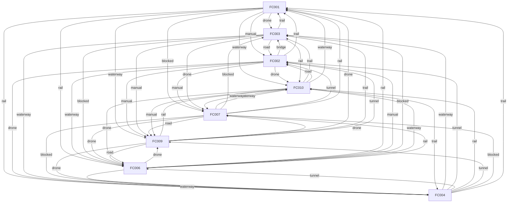

```mermaid
graph TD

%% Fulfillment Centers (Active)
FC001["FC001"]
FC002["FC002"]
FC003["FC003"]
FC004["FC004"]
FC006["FC006"]
FC007["FC007"]
FC009["FC009"]
FC010["FC010"]


%% FC001 connections
FC001 -->|drone| FC003
FC001 -->|waterway| FC010
FC001 -->|rail| FC004
FC001 -->|rail| FC006
FC001 -->|manual| FC002
FC001 -->|waterway| FC009
FC001 -->|blocked| FC007

%% FC002 connections
FC002 -->|drone| FC010
FC002 -->|manual| FC007
FC002 -->|waterway| FC006
FC002 -->|drone| FC004
FC002 -->|manual| FC009
FC002 -->|bridge| FC003
FC002 -->|trail| FC001

%% FC003 connections
FC003 -->|road| FC002
FC003 -->|trail| FC001
FC003 -->|waterway| FC004
FC003 -->|drone| FC007
FC003 -->|rail| FC010
FC003 -->|manual| FC009
FC003 -->|blocked| FC006

%% FC004 connections
FC004 -->|waterway| FC003
FC004 -->|tunnel| FC002
FC004 -->|tunnel| FC006
FC004 -->|rail| FC010
FC004 -->|tunnel| FC009
FC004 -->|blocked| FC007
FC004 -->|trail| FC001

%% FC006 connections
FC006 -->|waterway| FC004
FC006 -->|drone| FC009
FC006 -->|rail| FC001
FC006 -->|manual| FC002
FC006 -->|blocked| FC003
FC006 -->|waterway| FC010
FC006 -->|rail| FC007

%% FC007 connections
FC007 -->|road| FC009
FC007 -->|waterway| FC010
FC007 -->|blocked| FC003
FC007 -->|tunnel| FC002
FC007 -->|blocked| FC004
FC007 -->|drone| FC006
FC007 -->|rail| FC001

%% FC009 connections
FC009 -->|road| FC006
FC009 -->|rail| FC010
FC009 -->|drone| FC001
FC009 -->|drone| FC004
FC009 -->|drone| FC007
FC009 -->|trail| FC003
FC009 -->|tunnel| FC002

%% FC010 connections
FC010 -->|trail| FC003
FC010 -->|road| FC002
FC010 -->|waterway| FC007
FC010 -->|drone| FC006
FC010 -->|waterway| FC001
FC010 -->|trail| FC004
FC010 -->|manual| FC009

```