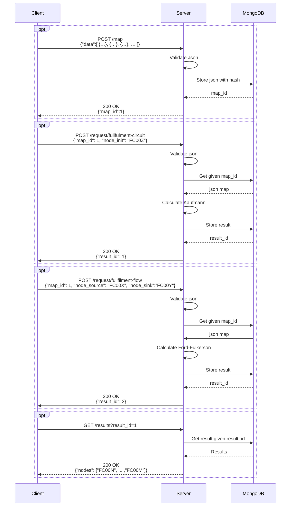

# Lab02

# Happy Path:

```mermaid
sequenceDiagram
	participant Client
	participant Server
	participant MongoDB
	opt
		Client->>Server: POST /map <br> {"data":[ {…}, {…}, {…}, … ]}
		Server->>Server: Validate Json
		Server->>MongoDB: Store json with hash
		MongoDB-->>Server: map_id
		Server-->>Client: 200 OK <br> {"map_id":1}
	end
	opt
		Client->>Server: POST /request/fullfulment-circuit <br> {"map_id": 1, "node_init": "FC00Z"}
		Server->>Server: Validate json
		Server->>MongoDB: Get given map_id
		MongoDB-->>Server: json map
		Server->>Server: Calculate Kaufmann
		Server->>MongoDB: Store result
		MongoDB-->>Server: result_id
		Server->>Client: 200 OK <br> {"result_id": 1}
	end
	opt
		Client->>Server: POST /request/fullfilment-flow <br> {"map_id": 1, "node_source":,"FC00X", "node_sink":"FC00Y"}
		Server->>Server: Validate json
		Server->>MongoDB: Get given map_id
		MongoDB->>Server: json map
		Server->>Server: Calculate Ford-Fulkerson
		Server->>MongoDB: Store result
		MongoDB-->>Server: result_id
		Server->>Client: 200 OK <br> {"result_id": 2}
	end
	opt
		Client->>Server: GET /results?result_id=1
		Server->>MongoDB: Get result given result_id
		MongoDB-->> Server: Results
		Server -->> Client: 200 OK <br> {"nodes": ["FC00N", ... ,"FC00M"]}
	end

```
